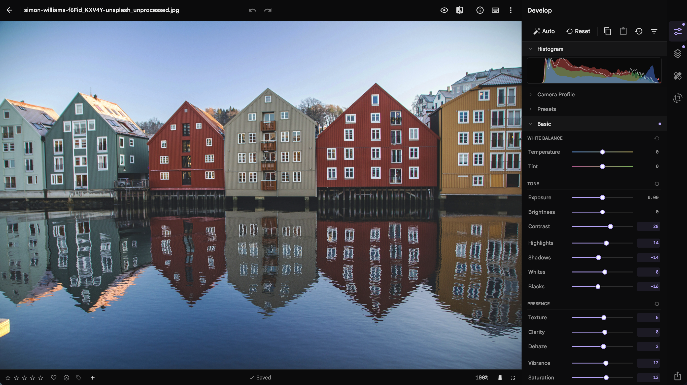

#  immich-edit

A self-hosted, non-destructive RAW editor for an existing
[Immich](https://immich.app/) library. It browses assets through Immich, renders on the server, and
stores edits locally. Originals remain unchanged.

> [!WARNING]
> immich-edit is under active `0.x` development. Back up `DATA_DIR`, read the upgrade notes, and
> keep a separate backup of the Immich library.

_Photo by [Simon Williams](https://unsplash.com/@simowilliams) on
[Unsplash](https://unsplash.com/photos/multicolored-village-wallpaper-f6Fid_KXV4Y)._

<!-- SCREENSHOT: Capture the app viewport at 2728x1530 with Develop > Basic open and Camera Profile and Presets collapsed. -->

## Documentation

- [Getting started](https://haavardnk.github.io/immich-edit/getting-started/)
- [Feature matrix](https://haavardnk.github.io/immich-edit/features/)
- [Deployment](https://haavardnk.github.io/immich-edit/deploy/)
- [Backup and upgrade](https://haavardnk.github.io/immich-edit/backup-and-upgrade/)
- [Troubleshooting](https://haavardnk.github.io/immich-edit/troubleshooting/)

## Project

Ask usage and setup questions in
[GitHub Discussions](https://github.com/haavardnk/immich-edit/discussions). Use
[GitHub Issues](https://github.com/haavardnk/immich-edit/issues) for reproducible bugs and feature
requests. Read [CONTRIBUTING.md](CONTRIBUTING.md) before submitting a change. Report vulnerabilities
through [GitHub Security Advisories](https://github.com/haavardnk/immich-edit/security/advisories/new).

Community support is best effort, with no response-time guarantee.

Licensed under [AGPL-3.0-only](LICENSE).
See the [attributions](https://haavardnk.github.io/immich-edit/attributions/) for projects and
bundled camera profiles used by immich-edit.
