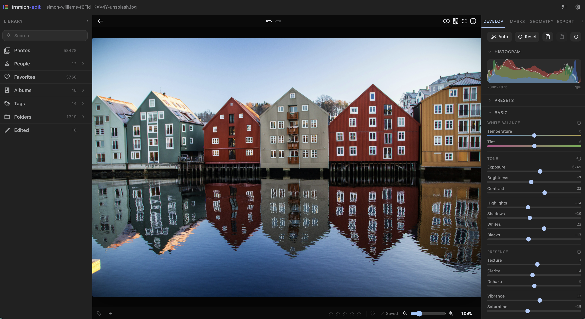

#  immich-edit

A non-destructive RAW editor for your [Immich](https://immich.app/) library. Browse albums in the browser, render previews and exports on the server, and keep the edits outside Immich. Originals stay untouched.

> **Active development.** Expect breaking changes and occasional migrations that require clearing the cache or database. There is no upgrade path between 0.x releases yet. Run it against a backup, not your only copy.



<sub>Photo by [Simon Williams](https://unsplash.com/@simowilliams?utm_source=unsplash&utm_medium=referral&utm_content=creditCopyText) on [Unsplash](https://unsplash.com/photos/multicolored-village-wallpaper-f6Fid_KXV4Y?utm_source=unsplash&utm_medium=referral&utm_content=creditCopyText)</sub>

## Why

I wanted Lightroom-style edits on my Immich library without sending photos to the cloud, without exporting to disk first, and without giving up RAW. Nothing in the Immich plugin ecosystem covered this, so I started building it. It is opinionated, single-user, and shaped around how I work.

## What works

Rendering and decoding:

- All RAW formats that [rawler](https://github.com/dnglab/dnglab/tree/main/rawler) supports (.arw, .cr2, .cr3, .nef, .dng, etc.)
- JPEG, PNG, TIFF, WebP, HEIC, AVIF, JPEG XL, GIF, BMP
- GPU rendering via wgpu (Vulkan on Linux, Metal on macOS), CPU fallback always available

Browsing / culling:

- Browse photos, albums, favorites, people, and tags with filters for rating, dates, filename, visibility, favorites, and rejects
- Cull from the grid, loupe, or editor with keyboard shortcuts for stars, favorites, and reject marks
- Hide rejected photos without deleting them

Edits:

- Exposure, contrast, brightness, highlights, shadows, blacks, whites
- White balance (camera, auto, custom temp/tint)
- HSL, saturation, vibrance, color grading
- Curves (RGB, R, G, B, luma)
- Clarity, texture, dehaze, sharpening, luma + color noise reduction
- Vignette, grain
- Crop, rotate, flip
- Local masks (radial, linear, brush, luminance range, color range) with adjustable parameters
- Lens corrections via lensfun profiles (distortion, vignette, chromatic aberration)
- Presets (save, apply, batch apply across selections)
- Undo/redo while editing, plus saved edit history with expandable change details and restore

Batch:

- Multi-select in the grid, or select everything matching a filter
- Apply presets, copy/paste edits, or reset edits across the selection
- Export or push back to Immich in bulk
- Runs as background jobs with progress tracking

Export:

- JPEG, PNG (8/16-bit), WebP, AVIF, HEIC, TIFF (8/16-bit), JPEG XL (8/16-bit)
- Push edited results back to Immich as a new asset

## What does not work yet

- Single-user only. One shared auth token, no accounts.
- No HDR output, no DNG export, no PSD compatibility, no LUT support
- No AI features
- Histograms and clipping warnings are basic
- No mobile layout
- CPU rendering is slow; use the GPU path if you can

## Data handling

immich-edit never deletes assets. Your photo edits are non-destructive: they are stored in immich-edit's SQLite database, and your Immich originals are never touched.

Some actions do write metadata back to Immich so the two stay in sync: star ratings, favorites, tags, and reject marks (an `immich-edit/reject` tag). Rejecting a photo dims it in the grid and loupe and lets you filter it out, but it stays in your library and nothing is removed.

The first time you do one of these actions, immich-edit asks you to confirm. After you agree, it won't ask again on that device.

## Quick start

The published container image is [`haavardnk/immich-edit`](https://hub.docker.com/r/haavardnk/immich-edit) on Docker Hub. `latest` tracks the newest stable release; `edge` tracks the newest build including prereleases. Pin an exact tag like `0.2.0` if you want upgrades to be explicit. See [available tags](docs/deploy.md#image-tags).

Create `compose.yaml`:

```yaml
services:
  immich-edit:
    image: haavardnk/immich-edit:latest
    ports:
      - "3000:3000"
    env_file:
      - .env
    volumes:
      - immich-edit-cache:/cache
    restart: unless-stopped

volumes:
  immich-edit-cache:
```

Create `.env` next to it:

```env
IMMICH_URL=http://immich-server:2283
IMMICH_API_KEY=your-api-key-here
AUTH_TOKEN=choose-a-long-random-token
```

Start it:

```bash
docker compose up -d
```

To build from source or run a local dev setup, see [Development](#development).

Open `http://localhost:3000` and log in with the token.

`AUTH_TOKEN` is optional only when the server binds to a loopback address. The Docker Compose example binds to `0.0.0.0`, so set a token unless you also change the bind/security settings.

For anything beyond a trusted LAN, put immich-edit behind a reverse proxy that handles TLS and authentication (Authelia, Authentik, oauth2-proxy, Caddy `basic_auth`, Traefik ForwardAuth). The shared token is a single secret, not a user system. See [docs/deploy.md](docs/deploy.md) for proxy examples.

## Documentation

- [Deploy guide](docs/deploy.md) - Docker, native, reverse-proxy, GPU passthrough, backups, upgrades
- [Troubleshooting](docs/troubleshooting.md) - common errors and how to diagnose them
- [Raw pipeline](docs/pipeline.md) - contributor reference for operator and render-pass ownership

## Configuration

Settings use environment variables or an optional TOML file selected with `IMMICH_EDIT_CONFIG`. Environment variables override values from the file. See [.env.example](.env.example) for the full environment-variable list and [docs/deploy.md](docs/deploy.md#configuration-file) for a TOML example.

`IMMICH_URL` and `IMMICH_API_KEY` are required. Most other settings can stay unset.

## GPU acceleration

GPU rendering is much faster than CPU rendering, especially on large RAWs. `wgpu` picks the backend at startup. Check `GET /api/health` to see which renderer is active.

To enable a GPU in Docker, uncomment the matching block in [docker-compose.example.yml](docker-compose.example.yml) and restart.

| Host | Backend | Setup |
|---|---|---|
| Linux, AMD or Intel iGPU | Vulkan | Pass `/dev/dri` and add `video` + `render` groups. The image includes Mesa Vulkan drivers. |
| Linux, NVIDIA | Vulkan | Install `nvidia-container-toolkit` on the host and use the `deploy.resources.reservations.devices` block. |
| macOS, native | Metal | Run the binary directly. |
| macOS, in Docker | none | Falls back to CPU. Metal cannot be passed into a container. |

`IMMICH_EDIT_RENDERER` controls the renderer:

- `auto` (default): use GPU when available, otherwise use CPU
- `gpu`: prefer GPU and log an error if it is missing, then use CPU
- `cpu`: use CPU only

If the GPU path is not active, check the backend startup logs for the wgpu adapter line.

## Development

Local development runs without Docker. See [CONTRIBUTING.md](CONTRIBUTING.md) for system dependencies and commands.

## License

[AGPL-3.0-only](LICENSE).

Use it, modify it, run it on your own server. If you host a modified version where other people can reach it over a network, you have to make your source available to those users.

## Acknowledgments

- [Immich](https://immich.app/) for the platform this plugs into
- [RapidRAW](https://github.com/CyberTimon/RapidRAW) for pipeline inspiration
- [rawler](https://github.com/dnglab/dnglab) for RAW parsing
- [wgpu](https://wgpu.rs/) for GPU rendering in Rust
- [lensfun](https://lensfun.github.io/) for the lens correction database
